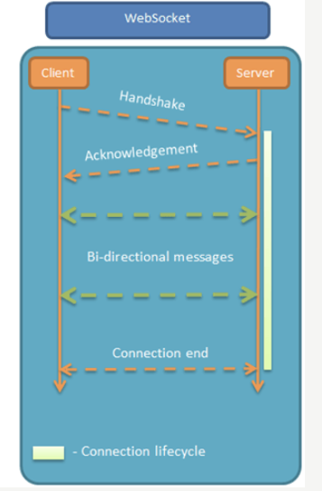
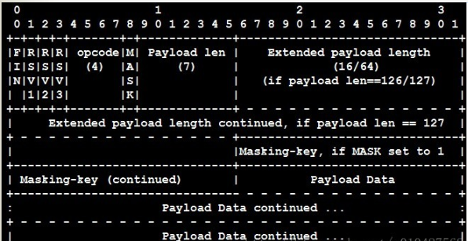
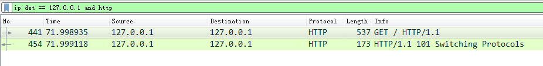
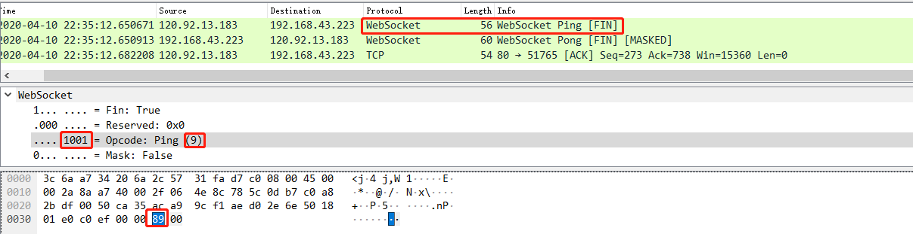
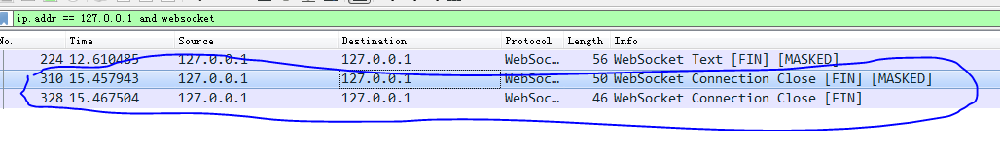

# Quick Start：

## 简介：

[WebSocket](http://websocket.org/) 是一种网络通信协议，是html5提出的一个协议规范，很多高级功能都需要它。

WebSocket基于tcp，先通过HTTP/HTTPS协议发起一条特殊的http请求进行握手后创建一个用于交换数据的TCP连接。**Websocket默认支持长连接。使用ES7新标准的async/await特性，可以实现WebSocket的短连接**。


初次接触 WebSocket 的人，都会问同样的问题：我们已经有了 HTTP 协议，为什么还需要另一个协议？它能带来什么好处？

答案很简单，因为 **HTTP 协议有一个缺陷**：**通信只能由客户端发起**。

举例来说，我们想了解今天的天气，只能是客户端向服务器发出请求，服务器返回查询结果。HTTP 协议做不到服务器主动向客户端推送信息。

 WebSocket的最大特点就是，服务器可以主动向客户端推送信息，客户端也可以主动向服务器发送信息，是真正的双向平等对话，属于[服务器推送技术](https://en.wikipedia.org/wiki/Push_technology)的一种。



其他特点包括：

（1）建立在 TCP 协议之上，服务器端的实现比较容易。

（2）与 HTTP 协议有着良好的兼容性。默认端口也是80和443，并且握手阶段采用 HTTP 协议，因此握手时不容易屏蔽，能通过各种 HTTP 代理服务器。

（3）数据格式比较轻量，性能开销小，通信高效。

（4）可以发送文本，也可以发送二进制数据。

（5）没有同源限制，客户端可以与任意服务器通信。

（6）协议标识符是`ws`（如果加密，则为`wss`），服务器网址就是 URL。


## 协议格式：



## 连接：

websocket连接时使用HTTP协议，但是在建立连接之后，真正的数据传输阶段是不需要HTTP协议参与。

连接建立过程:
1、客户端发送GET 请求， upgrade
2、服务器给客户端 switching protocol
3、就进行了webSocket的通信了



## 保活：

目前都是服务端ping客户端，客户端pong，然后服务端akc，说明成功接收了WebSocket的Pong回复包。



## 断开：

客户端主动断开：



## libwebsocket：

libwebsockets是一款轻量级用来开发服务器和客户端的C库。按照官方（https://libwebsockets.org/）给出的介绍来看，它不仅**支持ws，wss**还同时**支持http与https**，可以轻轻松松结合openssl等库来实现ssl加密。

源代码地址：https://github.com/warmcat/libwebsockets


# 调试：

当前代码支持作为ws服务端、客户端；http服务端、客户端。

## 配置：

将ctrl进行如下配置，设置成监听模式`tcplisten`，作为服务器：

这里`linktype`设置为`tcplisten`链路为长链接，设置为`httplisten`链路为短链接。

## ws方式：

使用websocket测试工具：https://www.idcd.com/tool/socket

url设置为：ws://localhost:8090

首先进行初始化：

```
[2021-03-09 09:32:30][DEBUG] cb pCtrl:02E19958  wsi:02E3B3F0  reason:27   //  LWS_CALLBACK_PROTOCOL_INIT
[2021-03-09 09:32:30][DEBUG] cb pCtrl:02E19958  wsi:02E3B3F0  reason:27
[2021-03-09 09:32:30][DEBUG] cb pCtrl:02E19958  wsi:02E3B3F0  reason:71   //  LWS_CALLBACK_EVENT_WAIT_CANCELLED
[2021-03-09 09:32:30][DEBUG] cb pCtrl:02E19958  wsi:02E3B3F0  reason:71
```

使用websocket测试工具**连接**到核心，libwebsocket会触发以下流程：

```
////// 发起一次websocket链接 //////
[2021-03-09 09:32:41][DEBUG] cb pCtrl:02E19958  wsi:04DD5188  reason:17   // LWS_CALLBACK_FILTER_NETWORK_CONNECTION  
[2021-03-09 09:32:41][DEBUG] cb pCtrl:02E19958  wsi:02EDF598  reason:29   // LWS_CALLBACK_WSI_CREATE
[2021-03-09 09:32:41][DEBUG] cb pCtrl:02E19958  wsi:02EDF598  reason:19   // LWS_CALLBACK_SERVER_NEW_CLIENT_INSTANTIATED
[2021-03-09 09:32:41][DEBUG] cb pCtrl:02E19958  wsi:02E3B3F0  reason:71   // LWS_CALLBACK_FILTER_NETWORK_CONNECTION
[2021-03-09 09:32:41][DEBUG] cb pCtrl:02E19958  wsi:02E3B3F0  reason:71    
[2021-03-09 09:32:41][DEBUG] cb pCtrl:02E19958  wsi:02EDF598  reason:86   // LWS_CALLBACK_HTTP_CONFIRM_UPGRADE
[2021-03-09 09:32:41][DEBUG] cb pCtrl:02E19958  wsi:02EDF598  reason:49   // LWS_CALLBACK_HTTP_BIND_PROTOCOL
[2021-03-09 09:32:41][DEBUG] cb pCtrl:02E19958  wsi:02EDF598  reason:20   // LWS_CALLBACK_FILTER_PROTOCOL_CONNECTION
[2021-03-09 09:32:41][DEBUG] cb pCtrl:02E19958  wsi:02EDF598  reason:53   // LWS_CALLBACK_ADD_HEADERS
[2021-03-09 09:32:41][DEBUG] cb pCtrl:02E19958  wsi:02EDF598  reason:0    // LWS_CALLBACK_ESTABLISHED --代码里面只关心0这个状态  意为ws服务器服务端接收到链接，这里创建链路用来保存数据。
```

接着使用websocket测试工具**发送数据**，触发以下流程：

```
[2021-03-09 10:05:47][DEBUG] cb pCtrl:02E19958  wsi:02EDF598  reason:6     // LWS_CALLBACK_RECEIVE 接收到数据
[2021-03-09 10:05:47][DEBUG] receive data from ip = 127.0.0.1, body = hello worldxyy9jJ1q3M=     /// 发送的数据hello world
[2021-03-09 10:05:47][DEBUG]  CLinkBase::Recv push=11, memlen=0
[2021-03-09 10:05:47][INFO] [CProcessor::AnalyRoute]---VERMGR Http Msg m_pAnalyPugin->AnalyRoute nDataLen = 11
[2021-03-09 10:05:47][INFO] CMgrData---VERMGR PcspTxt nDataLen = 11
[2021-03-09 10:05:47][DATA] [ANALY]    [msg][mpulisten]: result = 1!
[2021-03-09 10:05:47][ERROR]  CLinkBase::ÍⲿhttpÏûÏ¢Recv msg unknown len = 0, name=mpuserver , evt = 0  noteid=2030819979619729410
[2021-03-09 10:05:47][DEBUG] cb pCtrl:02E19958  wsi:02EDF598  reason:11     //  LWS_CALLBACK_SERVER_WRITEABLE  链路已准备好，可写
//  没有此句，则不能往外发送数据，只有写了此句，才能往客户端发送数据。
```

接着使用websocket测试工具**断开连接**，触发以下流程，同时链路被删除：

```
PCSP->[2021-03-09 10:01:05][DEBUG] cb pCtrl:02E19958  wsi:02EDF598  reason:38 // LWS_CALLBACK_WS_PEER_INITIATED_CLOSE
[2021-03-09 10:01:05][DEBUG] cb pCtrl:02E19958  wsi:02EDF598  reason:78       // LWS_CALLBACK_WS_SERVER_DROP_PROTOCOL
[2021-03-09 10:01:05][DEBUG] cb pCtrl:02E19958  wsi:02EDF598  reason:4        // LWS_CALLBACK_CLOSED  --代码里面只关心4这个状态  意为ws服务器服务端接收到断开链接。

[2021-03-09 10:01:05][DEBUG] receive disconnect from ip = 127.0.0.1
[2021-03-09 10:01:05][INFO] OnDisconnect Delete link handle = 49149336
[2021-03-09 10:01:05][DATA] CMgrRoute::Route_Del nodeid=2030819996799598595, nodetype = 2 nDepth = 0
[2021-03-09 10:01:05][DATA] CMgrRoute::Route_Del nodeid=2030819979619729409, nodetype = 3 nDepth = 0
[2021-03-09 10:01:05][DATA] CMgrRoute::Route_Del nodeid=2030819992504631298, nodetype = 3 nDepth = 1
[2021-03-09 10:01:05][DATA] CMgrRoute::Route_Del nodeid=2030819979619729410, nodetype = 3 nDepth = 2
[2021-03-09 10:01:05][DATA] CMgrRoute::Route_Del nodeid=2030819996799598595, nodetype = 3 nDepth = 3
[2021-03-09 10:01:05][INFO] CLinkBase::DelLink
[2021-03-09 10:01:05][INFO] CLinkBase::DelLink m_mapLink size = 0, m_mapHandle = 0
[2021-03-09 10:01:05][DEBUG] cb pCtrl:02E19958  wsi:02EDF598  reason:30    // LWS_CALLBACK_WSI_DESTROY  链接断开

```

基于上述调试结果，总结下对于ws服务器正常流程下重要的状态码【**项目代码在这些状态码下有所处理**】：

| 状态码                        | 值   | 含义                                                         |
| ----------------------------- | ---- | ------------------------------------------------------------ |
| LWS_CALLBACK_ESTABLISHED      | 0    | ws服务端和客户端建立起连接。                                 |
| LWS_CALLBACK_RECEIVE          | 6    | 收到一帧完整数据注，需要注意的是：指针的回收、释放始终由LWS框架管理，只要出了回调函数，该空间就会被LWS框架回收。因此，开发者若想将接收的数据进行转发，则必须对该数据进行拷贝。 |
| LWS_CALLBACK_SERVER_WRITEABLE | 11   | 此ws连接为可写状态注：表示wsi对应的ws连接当前处于可写状态，即：可发送数据至客户端。 |
| LWS_CALLBACK_CLOSED           | 4    | ws连接已经断开，不能在此释放内存空间，否则存在内存泄漏的风险！！！因为连接断开时，并不总是会回调LWS_CALLBACK_CLOSED的处理！ |


## http方式：

配置不变，使用**postman**进行测试：

post操作：

```
PCSP->  // postman post
[2021-03-09 11:05:36][DEBUG] cb pCtrl:035CC438  wsi:04AB6BD0  reason:17
[2021-03-09 11:05:36][DEBUG] cb pCtrl:035CC438  wsi:04AC0880  reason:29
[2021-03-09 11:05:36][DEBUG] cb pCtrl:035CC438  wsi:04AC0880  reason:19
[2021-03-09 11:05:36][DEBUG] cb pCtrl:035CC438  wsi:035EDC40  reason:71
[2021-03-09 11:05:36][DEBUG] cb pCtrl:035CC438  wsi:035EDC40  reason:71
[2021-03-09 11:05:36][DEBUG] cb pCtrl:035CC438  wsi:04AC0880  reason:18    // LWS_CALLBACK_FILTER_HTTP_CONNECTION    
[2021-03-09 11:05:36][DEBUG] cb pCtrl:035CC438  wsi:04AC0880  reason:49    // LWS_CALLBACK_HTTP_BIND_PROTOCOL
[2021-03-09 11:05:36][DEBUG] cb pCtrl:035CC438  wsi:04AC0880  reason:12    // LWS_CALLBACK_HTTP    收到http消息头
[2021-03-09 11:05:36][DEBUG] receive http connection from ip = 127.0.0.1, header =/v1/api/createtoken
[2021-03-09 11:05:36][INFO] CLinkBase::AddLink
[2021-03-09 11:05:36][INFO] CLinkBase::AddLink m_mapLink size = 1, m_mapHandle = 1
[2021-03-09 11:05:36][DATA] CMgrRoute::Route_BindFriend u64NodeId = 8061481845964931074, u64SubNodeId = 8061481828785061889,
[2021-03-09 11:05:36][DATA] CMgrRoute::Route_Add nodeid=8061481845964931074, routeid=8061481828785061889. nDepth = 0
[2021-03-09 11:05:36][DATA] CMgrRoute::Route_Add nodeid=8061481828785061889, routeid=8061481845964931074. nDepth = 0
[2021-03-09 11:05:36][DATA] CMgrRoute::Route_Add nodeid=8061481841669963778, routeid=8061481828785061889. nDepth = 1
[2021-03-09 11:05:36][DATA] CMgrRoute::Route_Add nodeid=8061481828785061890, routeid=8061481841669963778. nDepth = 2
[2021-03-09 11:05:36][DEBUG] cb pCtrl:035CC438  wsi:04AC0880  reason:13      //  LWS_CALLBACK_HTTP_BODY 收到http消息体
[2021-03-09 11:05:36][DEBUG] receive http data from ip = 127.0.0.1, http =
  {
     "UserName": "keda",
     "RequestId" : "1614738418531"
  }-CN,zh;q=0.9
Sec-WebSHTTP/1.1 101 Switching Protocols
Upgrade: WebSocket
Connection: Upgrade
Sec-WebSocket-Accept: uVm8qCXhp92Wa3WDCzPoAyD2dIg=

[2021-03-09 11:05:36][DEBUG]  CLinkBase::Recv push=70, memlen=0
[2021-03-09 11:05:36][INFO] [CProcessor::AnalyRoute]---VERMGR Http Msg m_pAnalyPugin->AnalyRoute nDataLen = 70
[2021-03-09 11:05:36][INFO] CMgrData---VERMGR PcspTxt nDataLen = 70
[2021-03-09 11:05:36][DATA] [ANALY]    [msg][mpulisten]: result = 1!
[2021-03-09 11:05:36][ERROR]  CLinkBase::ÍⲿhttpÏûÏ¢Recv msg unknown len = 0, name=mpuserver , evt = 0  noteid=8061481828785061890
[2021-03-09 11:05:36][DEBUG] cb pCtrl:035CC438  wsi:04AC0880  reason:14    //  LWS_CALLBACK_HTTP_BODY_COMPLETION
[2021-03-09 11:05:36][DEBUG] cb pCtrl:035CC438  wsi:04AC0880  reason:16    //  LWS_CALLBACK_HTTP_WRITEABLE
```

postman取消等待响应，会发送一条断开：

```
// post cancel
[2021-03-09 11:05:44][DEBUG] cb pCtrl:035CC438  wsi:04AC0880  reason:50   // LWS_CALLBACK_HTTP_DROP_PROTOCOL
[2021-03-09 11:05:44][DEBUG] cb pCtrl:035CC438  wsi:04AC0880  reason:5    // LWS_CALLBACK_CLOSED_HTTP
[2021-03-09 11:05:44][DEBUG] receive http disconnect from ip = 127.0.0.1
[2021-03-09 11:05:44][INFO] OnDisconnect Delete link handle = 78383232
[2021-03-09 11:05:44][DATA] CMgrRoute::Route_Del nodeid=8061481845964931074, nodetype = 2 nDepth = 0
[2021-03-09 11:05:44][DATA] CMgrRoute::Route_Del nodeid=8061481828785061889, nodetype = 3 nDepth = 0
[2021-03-09 11:05:44][DATA] CMgrRoute::Route_Del nodeid=8061481841669963778, nodetype = 3 nDepth = 1
[2021-03-09 11:05:44][DATA] CMgrRoute::Route_Del nodeid=8061481828785061890, nodetype = 3 nDepth = 2
[2021-03-09 11:05:44][DATA] CMgrRoute::Route_Del nodeid=8061481845964931074, nodetype = 3 nDepth = 3
[2021-03-09 11:05:44][INFO] CLinkBase::DelLink
[2021-03-09 11:05:44][INFO] CLinkBase::DelLink m_mapLink size = 0, m_mapHandle = 0
[2021-03-09 11:05:44][DEBUG] cb pCtrl:035CC438  wsi:04AC0880  reason:30
```

基于上述调试结果，总结下对于http服务器正常流程下重要的状态码【**项目代码在这些状态码下有所处理**】：

| 状态码                      | 值   | 含义               |
| --------------------------- | ---- | ------------------ |
| LWS_CALLBACK_HTTP           | 12   | 收到http消息头     |
| LWS_CALLBACK_HTTP_BODY      | 13   | 收到http消息体     |
| LWS_CALLBACK_HTTP_WRITEABLE | 16   | 链路已准备好，可写 |
| LWS_CALLBACK_CLOSED_HTTP    | 5    | 收到断开连接       |


# 参考文献：

1. [(扫盲)WebSocket 教程](https://www.cnblogs.com/ximenxiazi/p/9233626.html)
2. [C++ 使用 websocket总结](https://zhuanlan.zhihu.com/p/250276105)
3. [WebSocket 的诞生](https://www.cnblogs.com/zhangmingda/p/12678630.html)
4. [WebSocket 连接建立过程](https://www.jianshu.com/p/bae7ea3e9adb)
5. [C++ libwebsockets搭建WebSocket服务端及Http客户端、服务端](https://blog.csdn.net/fantasysolo/article/details/88908948)

