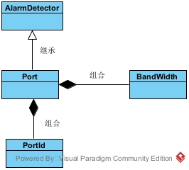
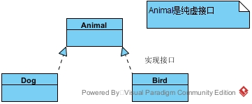
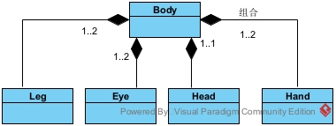
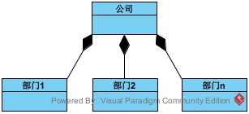
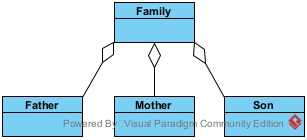

# 类的关系：

介绍几种常见的类与类之间的关系：继承、实现、组合、聚合、依赖。

这里的关系都是语义上的，和语言没有关系。

支持面向对象的语言通过代码表达这些关系时有不同的形式（惯用法）。

这里主要总结下C++下的实现。


# 继承（Generalization）：

继承又称为**泛化**，继承是面向对象的三大特征之一，是一种最能体现面向对象代码复用的类关系。

C++的继承是从语法上讲的，是语法特性，类和类直接的继承关系是从语义上讲的，所以这两个继承不是同一个东西。

在如下情况下可以考虑使用C++的继承特性：

1. 代码复用；
2. 实现接口（也可以认为是能力约束）；
3. 整体和局部为1:1的组合关系使用私有继承；


```cpp
using PortId = int;

class AlarmDetector
{
	virtual bool hasAlarm() const = 0;
	virtual ~AlarmDetector(){}
};

class Port :public AlarmDetector
	      , private BandWidth
{
public:
	Port(PortId id);
	Connection* connect(const PeerNode& peer);
private:
	bool hasAlarm() const override; // 覆写方法私有化,禁止从具体类上调用覆写的虚函数
private:
	PortId id;
};
```





`AlarmDetector`和`Port`就是继承关系（更加准确点是实现关系）；

`BandWidth`虽然用到了C++的继承语法，但是从语义上，和`Port`的关系却是组合关系。


## public：

对于接口一般使用public继承；

客户从上向下使用接口类；

覆写方法私有化，禁止从具体类上调用覆写的虚函数。


## private：

私有继承（以及保护继承），实际上是一种组合（Composition），是生命周期一致的1:1组合关系的一种实现方式。


# 实现（Realization）：

**实现是继承的一个特例**，子类继承的是一个**接口类**，在C++中，接口通过的纯虚函数来实现：

```cpp
class Animal
{
public:
    virtual ~Animal() {}

    virtual std::string move() const = 0;
};

class Dog :public Animal
{
private:
    std::string move() const override
    {
        return "run";
    }
};

class Bird :public Animal
{
private:
    std::string move() const override
    {
        return "fly";
    }
};
```





# 组合（Composition）：

组合是一种较为紧密的关系，从生命周期上看，部分和整体是共存亡的关系。比较常见的实现方式如下：

```cpp
class Body 
{
private:
	Hand  m_hand[2];
	Head  m_head;
	Leg m_leg[2];
	Eye m_eye[2];
};
```





如果整体和局部是1:1的关系，也可以使用C++的继承语法：

```cpp
class 公司:private 部门1, private 部门2, private 部门n
{
    
}
```




这种做法不是很主流，书本上也很少见，但是C++实现DCI架构（多角色对象）时却很常见，可以参考本文：[小类，大对象](https://www.jianshu.com/p/a830d2261392)


# 聚合（Aggregation）：

聚合是一种较为松散的关系，部分和整体的生命周期未必一致。

在聚合关系中选择使用指针还是引用，要根据声明周期和依存关系。

1. 生命周期早于宿主使用引用，在构造函数中依赖注入；

```cpp
class Family
{
public:
	Family(Father& father, Mother& mother, Son& son);
private:
	Father& father;
	Mother& mother;
	Son& son;
};
```

2. 生命周期晚于宿主使用指针，在update类接口注入。

```cpp
class Family
{
public:
	Family();
	void update(Father* father, Mother* mother, Son* son);
private:
	Father* father;
	Mother* mother;
	Son* son;
};
```





# 依赖（Dependency）：

当类A的参数用到类B，或者类A的某个方法返回参数是另外一个类B，那么类A则依赖于类B：

```cpp
class Car{

};

class Person{
public:
	void work(Car* pCar);
	Car* fix(Car* pCar);
};
```


# 实际示例：

给个实际项目中的代码组织：


# 参考文献：

1. [组合和聚合的差别](https://www.jianshu.com/p/e74f90ae1802)
2. [类的关系C++实现](https://www.jianshu.com/p/1a81896710c2)
3. 2020 C++峰会  刘光聪 面向领域模型的C++实现模式
4. [C++类之间的六种关系及UML图](https://www.freesion.com/article/5839142884/)
5. [C++ 私有继承的妙用](https://www.jianshu.com/p/aa28a6a6d78d)